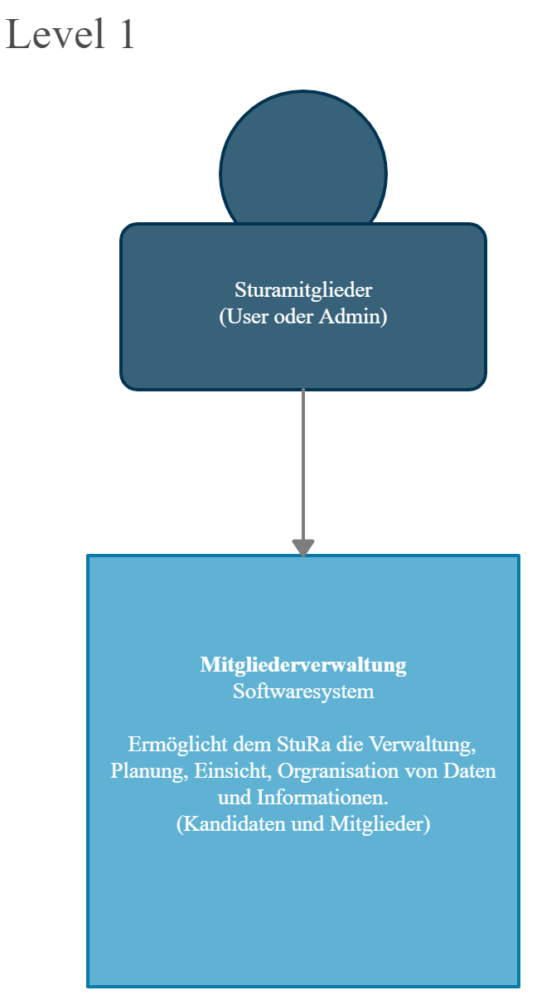

= Architecture Notebook: Projekt - Weiterentwicklung der Mitgliederdatenbank

== 1. Zweck

Dieses Dokument beschreibt wesentliche  Elemente der Softwarearchitektur, sowie andere übergreifende Aspekte des Systems für die Mitgliederdatenbank des StuRa. Hier werden im Folgenden auf die Ziele, Annahmen, die Architektonische Bedeutung, unsere Entscheidungen bzw. Einschränkungen und weitere Dinge eingegangen und Dokumentiert.

Mit Hilfe von verschiedenen Modellen und Entwürfen für die Architektur, soll die spätere Weiterentwicklung und Anpassung einfacher gemacht werden.

== 2. Architektonische Ziele und Philosophie

Für den Architekturentwurf ist zu berücksichtigen, dass eine Webanwendung mit Datenbank bereits vorhanden ist. Aus der Anforderungsanalyse ergeben sich damit folgende Ziele für den entwurf: +

Ziele:

- Vorarbeit für eine nahtlose und ressourcenschonende Erweiterung der Webanwendung
- Übersichtlichkeit bzw. Intuitive Bedienbarkeit.
- Anpassung/Erweiterung der Datenbank, um Funktionalitäten gewährleisten zu können.  
//kann man das schöner schreiben?

// - weitere Ziele

== 3. Annahmen und Abhängigkeiten

- Der Server auf dem die Webseite laufen soll bietet ausreichen Ressourcen
- bisher verwendete Datenbankmodelle und Frameworks können weiter verwendet werden
- die Mitgliederdatenbank wird in Zukunft funktional erweitert
// - weitere Annahmen und Abhängigkeiten

== 4. Architektonisch bedeutende Anforderungen

== 5. Entscheidungen, Einschränkungen und Begründungen

- Die Datenbank wird mit SQLite weitergeführt um Mehraufwand im Sinne von Umstrukturierung zu vermeiden
- aus selben Grund wird Python Programmiersprache ebenso weiterverwendet

//- weitere Entscheidungen, Nebenbedingungen und Begründungen 

== 6. Architekturmechanismen
// !!muss noch weiter ausgebaut werden!!
=== 6.1 Datenspeicherung
* Zweck: Speicherung der Daten von Mitgliedern und Kandidaten in der Mitgliederdatenbank

=== 6.2 Webschnitstelle
Die von Django bereitgestellte Schnittstelle wird verwendet um Daten über die Webseite zu Organisieren und zu Verwalten.

=== 6.3 Informationsvermittlung
Bereitstellung der Daten für Organisations- und Informationszwecke auf der Webseite

== 7. Schlüsselabstraktionen

== 8. Schichten oder Architektur-Framework

image::images/level2.png[level2,550,550]

== 9. Architektursicht (Views)
