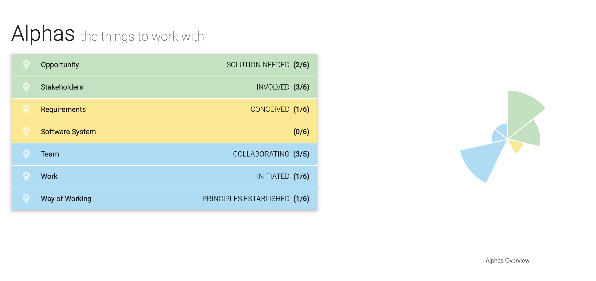

= Iteration Plan 02: {I4 - Weiterentwicklung der Mitgleiderdatenbank}
Manuela Ziesche <manuela.ziesche@htw-dresden.de>
{localdatetime}
:toc: 
:toc-title: Inhaltsverzeichnis
:sectnums:
:source-highlighter: highlightjs

== Meilensteine

.Meilensteine
|===
| *Meilenstein* | *Datum* | *Notizen*
| Beginn der Iteration | 21.12.2020 | 
| Teammeeting | 21.12.2020 | 
| Weihnachtsferien | 21.12.2020-03.01.2021| Stagnation des Projektfortschrittes
| Teammeeting | 04.01.2021 | Coaching von Felix Müller
| Teammeeting | 07.01.2021 | Architektur besprochen
| Ende der  Iteration 02 | 10.01.2021 | Assessment 

|===

== Wesentliche Ziele

- Architektur Entwicklung beginnen +
- Anforderungen verfeinern +
- erste Use Cases entwickeln +
- System lokal zum Laufen bekommen +
- erste Prototypen entwickeln +
- Essence Navigator +
- Work Item List fortführen +
- Risk List aktualisieren +

== Aufgabenzuordnung

Die Aufgaben, welche in der zweiten Iteration bearbeitet werden, folgen in der untenstehenden Tabelle: +
Alle Aufgaben aus dem gesamten Projekt werden in der *Work Item List* vermerkt:  <<link:../work_item_list.adoc[]>>

|===
| *Aufgabe bzw Beschreibung* | *Priorität* | *Schätzung der Größe* | *Status* | *Referenzen* | *Name* | *Gearbeitete Stunden*
| Essence Navigator | niedrig | 1 | erledigt | essence_navigator_images/Essence_Navigator.png[] | alle Teammitglieder | 1 
| Architecture Notebook | hoch | 6 | erledigt | <<link:../../architecture/architecture_notebook.adoc[]>>| Sebastian, Benjamin | 8
| System lokal zum Laufen bringen | hoch | 3 | | Vasco, Sabine | 2
| Iterationsplan 03 | hoch | 2 | erledigt | <<link:iteration_plans/iteration_plan03.adoc[]>> | Manuela | 2
| Risikoliste aktualisieren | mittel | 3 | erledigt | <<link:../risk_list.adoc[]>> | Manuela | 2
| Projektplan aktualisieren | niedrig | 1 | erledigt | <<link:../project_plan.adoc[]>> | Manuela | 2
|===
== Probleme 

.Probleme
|===
| *Problem* | *Status* | *Notizen*
| 'Weihnachten' | - | Die Zeit um Weihnachten und den Jahreswechsel hindert den Projektverlauf und wird nicht so produktiv genutzt, wie die restliche Zeit.
|===

== Bewertungskriterien

- Gemeinsame Inspektion des Iterations-Ergebnisses mit dem gesamten Team
- Überprüfung der Ziele der zweiten Iteration - haben wir diese erreicht?

== Assessment

.Assessment
|===
|*Assessment Ziel* | *Iteration 2 beenden*
|Assessment Datum | 11.01.2021
| Teilnehmer | alle
| Projektstatus | grün
|===

- Beurteilung im Vergleich zu den Zielen: Soll-Zustand: wir wollen alle Ziele erreichen, Ist-Zustand: 87,5% erreicht
- Geplante vs. erledigte Aufgaben: prinzipiell alle geplanten Aufgaben erledigt, nur keine Prototypen entwickelt
 

== Essence Navigator Bild

- alle Bilder aus den gesamten Iterationen finden Sie hier: +
<<link:../essence_navigator_images[]>> 

- Bild von der zweiten Iteration:

