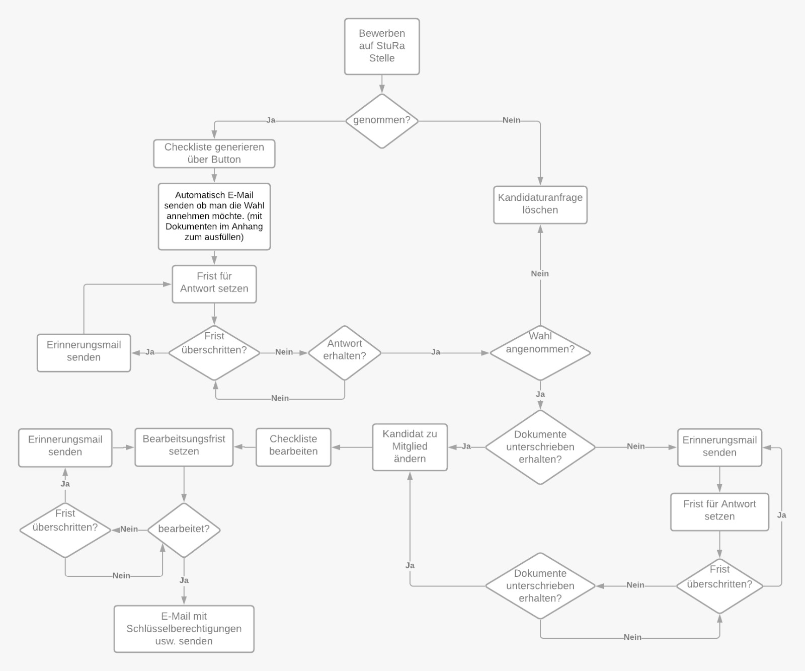

//Nutzen Sie dieses Template als Grundlage für die Spezifikation *einzelner* Use-Cases. Diese lassen sich dann per Include in das Use-Case Model Dokument einbinden (siehe Beispiel dort).
== Use-Case 03:  Mitgliederaufnahme

.Schematische Beschreibung der Mitgliederaufname

===	Kurzbeschreibung
Der Kandidat wird als Mitglied gewählt und im System als solcher übernommen. 
//Die Check-Liste wird nach Übernahme eines Kandidaten für den Admin automatisch erstellt 

===	Kurzbeschreibung der Akteure
==== Admin
Ist für die Mitgliederaufnahme und die Bearbeitung der Check-Listen zuständig

=== Vorbedingungen
//Vorbedingungen müssen erfüllt, damit der Use Case beginnen kann, z.B. Benutzer ist angemeldet, Warenkorb ist nicht leer...

* Die Internetseite ist geöffnet
* Der Admin muss angemeldet sein  
* Der Kandidat wurde laut den Wahlen gewählt
* Der Kandidat hat der Übernahme als Mitglied zugestimmt
* Der Kandidat hat die erforderlichen Dokumente unterschrieben und gesendet
* Check-Listen-Template muss für jede Organisationseinheit vorhanden sein 

=== Standardablauf (Basic Flow)
//Der Standardablauf definiert die Schritte für den Erfolgsfall ("Happy Path")

//. Der Use Case beginnt, wenn <Kunde> <macht>…
//. <Standardablauf Schritt 1>
//. 	…
//. <Standardablauf Schritt n>
//. Der Use Case ist abgeschlossen.
. Der Admin fügt den gewählten Kandidaten in "Mitglied" mittels Plus- Button hinzu
. Die Anwendung erstellt dabei automatisch unter dem Tab "Checklisten" eine Checkliste mit Aufgaben für jedes neue Mitglied, die der Admin erledigen bzw. abhaken muss.
. Die neue Checkliste wird am Ende aller offenen Checklisten aufgereiht 

===	Nachbedingungen
//Nachbedingungen beschreiben das Ergebnis des Use Case, z.B. einen bestimmten Systemzustand.
Check Liste mit zu erfüllenden Aufgaben für den Admin wurde erstellt

